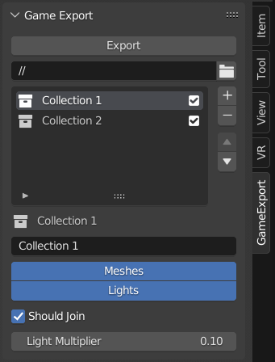

# Game Export

Exports multiple game assets with one click.

- Located under GameExport tab in the 3d view.
- **Export** button will export all enabled collections in the list below to an fbx (the fbx files are given the name of the collection)
- **Export File Path** is the folder to export fbx files to
- Add collections to the export list by clicking the plus and selecting the collection
- **Checkbox** next to collections indicates whether to export the collection
- Below the list are the export settings for the selected collection
- **Export Name** is what the file will be titled
- List of types is what the export should include
- **Should Join** will join all meshes together
- **Light Multiplier** will multiply the light intensity, useful when game engines use different units

Other notes
- Supports collection instances
- A collection can be in the export list multiple times; useful to export different object types separately
- Joins objects with different shading settings correctly*
- Export settings are saved under the scene

\* smooth and flat connected faces with auto smooth off very slightly change shading at the border