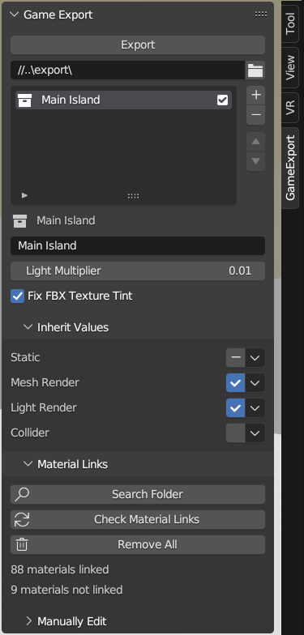
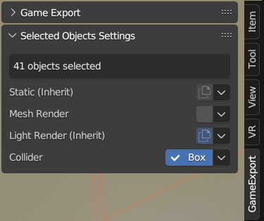

# Game Export Blender Addon

Configure settings and export from Blender to Unity with one click.

Exports collections as Unity prefabs along with mesh data in an fbx file. Lets you configure Unity static settings, material remapping, colliders, and more in blender. Joins collection instances into a single mesh. Instances mesh data.

## Why
Exporting from blender to Unity is not difficult. Unity is able to import directly from a blend file. However small things like needing change settings for new objects in Unity, setting up colliders, excluding parts from the export, etc. all add up and add room for error. The goal of this addon in to let you setup export settings in advance and export with one click.

Collection instances are a great way to scatter the same asset through out your scene, and still be able to edit it later. With this addon there is not need to join meshes in the instaced collection for performace as this is done for you at export. Also instaced collection can include any number of lights and colliders.

## Installation
Download the zip file from the [latest release](https://github.com/codec-xyz/game_export/releases/latest)

Instructions to install the zip file can be found here...

https://docs.blender.org/manual/en/latest/editors/preferences/addons.html#installing-add-ons

When installed expand the addon information box and click "Install missing modules"

## More Info

- First there is the export folder and a list of collections to export. Each collection will produce one prefab and one fbx file and their meta files if they are not already present.
- **Inherit values** are the object settings to be used when that value is marked as inherit on the object
- All object settings are set to inherit by default
- **Material Links** let you link your materials to Unity material files to use instead of materials exported in the fbx file

- Below that are the per object settings
- This box will show up when one or more objects are selected and shows the settings of all selected objects together
- Changing settings in this box changes the settings of all selected objects, not just the active one

## Notes on box colliders
- if you want to visualize the collider go to Object Properties > Viewport Display > Bounds check the box and make sure the dropdown is set to box
- if you want to rotate the collider you need to rotate the object, meaning rotate in object mode not edit mode
- I recommend using a cube mesh with mesh rendering turned off. As long as you rotate in object mode and do not skew the shape it will match the box collider exactly. In edit mode you can use the snap tool on the faces and double tapping an axis (x, y, z) when moving will lock to the local axis.

## Other notes
- Viewport disabled objects (the screen icon, not the eye icon) will cause the objects to be skipped during export
- Empty objects will be included in the exported prefab file

## Future
- Don't expect anything, but if anything does get done these are likely...
- More object settings
- Internal code improvments
- Fbx only export mode
- Armature export
- The goal of this addon is not just Blender to Unity, idealy there would options for other game engines, but this is unlikely to happen